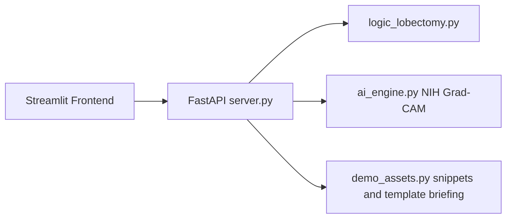

## Overview

This demo project aimed to develop a clinical decision support system that helps determine the optimal timing for chest tube removal in patients who underwent a lung lobectomy. The sLM was trained with AI-generated data, and open-source CXR images and annotations were used to fine-tune SwinUNETR and ResNet50 using the torchvision library.

## Skills

- **sLM (Small Language Model)**: The sLM was trained locally to mitigate the risk of data leakage.
- **FastAPI**: Provides the backend API to connect the system logic with the Streamlit frontend.
- **Fine-tuning**: In compliance with open-source data security protocols, no data was exposed to the third-party cloud API, and all data was permanently deleted after fine-tuning.

## System pipeline

## Disclaimer
- This repository is provided for research and portfolio demonstration only. **It is not intended for clinical diagnosis, treatment, or decision-making** without independent validation and appropriate regulatory review.

- The bundled demo chest X-ray is a synthetic image for UI demonstration. Do not replace it with identifiable clinical images or licensed dataset samples in public repositories.

## Contact
- For more information, please visit the following link (https://github.com/hhsong1121/ThorAI)